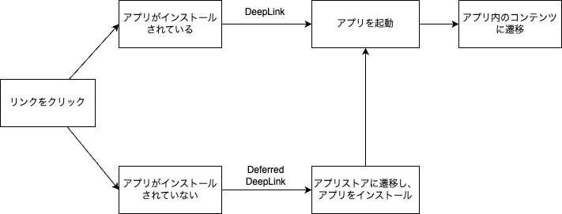
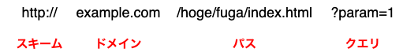

# DeepLink, Deferred DeepLink 関連の技術について
アプリにDeepLinkを実装したいと考え、検索をかけると複数の用語がヒットすると思います。
たとえば、「カスタムURLスキーム」「ユニバーサルリンク」「Android App Links」などです。

要件を満たすには何から手をつけて良いか迷いが生じたため、それぞれの特徴について整理しました。

全体の構造としては以下のようになります。
- DeepLink
  - カスタムURLスキーム
  - ユニバーサルリンク
  - Android App Links
...

- Deferred DeepLink
    - Firebase Dynamic Links
    - Adjust
    - AppsFlyer
...

アプリをインストールしていない場合にアプリストアに誘導するようにしたい場合は、通常のDeepLinkではなくDeferred DeepLink（ディファード・ディープリンク）を使用する必要があります。

そこで、まず初めにDeepLink と Deferred DeepLink の違いについてまとめていきます。

# DeepLink と Deferred DeepLink について
# DeepLink とは
DeepLink は、特定のアプリ内のページやコンテンツに直接リンクするための技術の総称を指します。
たとえば、ユーザーがリンクをクリックすると、そのリンクが特定のアプリを起動し、通常のアプリのトップページではなく、アプリ内の特定のページに直接誘導されます。

「カスタムURLスキーム」「ユニバーサルリンク」「AppsLink」などは、DeepLink を実現させるための手段です。
それぞれの特徴については後述します。

# Deferred DeepLink とは
Deferred DeepLink（ディファードディープリンク）を使用することで、ユーザーがアプリをインストールしていない場合でも、まずApp StoreやGoogle Playストアに誘導し、アプリがインストールされた後に元のリンクが指し示していたページやコンテンツに自動的に遷移させることができます。
このプロセスにより、ユーザーにシームレスな体験を提供し、アプリのコンテンツをスムーズに利用させることが可能です。



[ディープリンク入門：2022年版［レポート］ | AppsFlyer](https://www.appsflyer.com/ja/resources/guides/deep-linking-101/)

## ▼DeepLink, Deferred DeepLink の比較表
|            | **DeepLink** | **Deferred DeepLink** |
| ---------- | ------------ | --------------------- |
| **主な用途**   | インストール済みアプリの特定ページに誘導 | 未インストール時でも、インストール後に特定ページに誘導 |
| **動作の流れ** | クリックで即アプリ内の指定場所へ | クリック後にアプリストア経由でインストール後に指定場所へ |
| **メリット** | 迅速にアプリ内コンテンツにアクセス | 未インストールでも対応、インストール後の誘導が可能 |
| **デメリット** | アプリ未インストール時は動作しない | 実装が複雑で、処理が追加される |

# DeepLink を実現する技術について
## カスタムURLスキームとは
カスタムURLスキームは、特定のアプリを起動し、そのアプリ内の特定のページやコンテンツに直接アクセスするための技術です。
たとえば、`myapp://`のようなURLをクリックすると、対応するアプリが開き、指定されたページが表示されます。

＜参考：URLの構造＞


### メリット
- 比較的簡単に実装できる
- URLスキームを自由に設計でき、アプリの構造に合わせたリンクを作成できます。

### デメリット
- ユーザーがアプリをインストールしていない場合、リンクが機能せず、何も起こらないか、エラーメッセージが表示されることがあります。
- スキームの命名は管理されていないため、一般的なスキーム名を使用すると、他のアプリと競合するリスクがあります。

### 使用例
たとえば、ショッピングアプリで`myshop://product/12345`というカスタムURLスキームを設定すると、このリンクをクリックするだけで、特定の商品ページに直接アクセスできます。これにより、ユーザーを迅速に目的のコンテンツへ誘導し、スムーズな体験を提供できます。

### 実装方法を簡単に紹介
カスタムURLスキームのはプロパティの値を設定するだけで簡単に実装できます。
以下、iOSアプリの設定方法です。

1. アプリの設定
   1. XCodeからプロジェクトを開く
   2. info.plist に次のキーを追加
      1. URL Schemes：スキーマ文字列(複数指定可能)
      2. URL identifire：識別文字列(端末内でユニークであれば、なんでも良い)
   3. リンクのパスから各画面へ遷移するハンドリングコードを実装

URL Schemes に設定した文字列がカスタムURLスキームとなります。

参考：[[iOS] ディープリンク（Custom URL Scheme）でアプリを起動する | DevelopersIO](https://dev.classmethod.jp/articles/ios-custom-url-scheme/)

## ユニバーサルリンクとは
ユニバーサルリンクは、iOSデバイス上でアプリとウェブのコンテンツをシームレスに連携させるための技術です。
ユーザーが通常のウェブURLをクリックすると、対応するアプリがインストールされている場合にはアプリが開き、インストールされていない場合にはウェブページが表示されます。この仕組みにより、同じリンクでアプリとウェブの両方に対応することができます。

### メリット
- ユニバーサルリンクはHTTPSプロトコルを使用するため、安全性が高く、リンクの信頼性が確保されます。
- ユーザーが同じURLでアプリとウェブの両方にアクセスできるため、アプリがインストールされていない場合でもコンテンツに到達できます。
- アプリとウェブのリンクを統一できるため、管理が容易です。

### デメリット
- ユニバーサルリンクの実装には、ウェブサーバーとアプリ側の設定が必要で、導入がやや複雑です。
- アプリがインストールされていない場合、アプリストアへ直接誘導することができません。
  - 遷移先のウェブページにアプリストアへのリンクを記載することで、間接的に誘導することは可能です。

### 使用例
たとえば、ニュースアプリが`https://example.com/article/12345`というユニバーサルリンクを設定すると、ユーザーがこのリンクをクリックした際、アプリがインストールされていれば対応する記事がアプリ内で開かれ、インストールされていなければウェブブラウザで同じ記事が表示されます。

### 実装方法を簡単に紹介
ユニバーサルリンクを実装するには、アプリとサーバーの両方を設定する必要があります。

1. アプリの設定
   1. XCodeからプロジェクトを開く
   2. Signning & Capabilities から、Associated Domainsキーを追加
      1. キーの値として、applinks:yourdomain.com（yourdomain.comは置き換え）を指定する
   3. ユニバーサルリンク遷移時のハンドリングコードを実装
2. サーバーの設定
   1. サイトアソシエーションファイル（apple-app-site-association）を作成
   2. サーバーに作成したサイトアソシエーションファイルを配置
      1. https://<ディープリンクドメイン>/.well-known/apple-app-site-association 

**▼apple-app-site-association の例**
```
{
  "applinks": {
    "apps": [],
    "details": [
      {
        "appID": "TEAMID.BUNDLEID", // Apple Developer の「Certificates, Identifiers, & Profiles」から確認する
        "paths": ["*"]
      }
    ]
  }
}
```
[Supporting associated domains | Apple Developer Documentation](https://developer.apple.com/documentation/xcode/supporting-associated-domains)

## AppLinks とは
Android App Linksは、Androidプラットフォームにおけるユニバーサルリンクと同等の機能を提供する技術です。
このリンクを使用すると、ユーザーがウェブURLをクリックした際に、対応するアプリがインストールされていれば自動的にアプリが開き、特定のコンテンツに直接アクセスできます。
アプリがインストールされていない場合には、ウェブページが表示されるか、Google Playストアに誘導されます。

メリット、デメリット、使用例についてもユニバーサルリンクと同等なため、割愛します。

実装方法について、ユニバーサルリンクと流れは同じです。
AppLinksの場合、assetlinks.json ファイルをサーバーに配置します。（https://<ディープリンクドメイン>/.well-known/assetlinks.json）

**▼assetlinks.json の例**
```
[
	{
		"relation": [
			"delegate_permission/common.handle_all_urls"
		],
		"target": {
			"namespace": "android_app",
			"package_name": [パッケージ名],
			"sha256_cert_fingerprints": [[sha256署名フィンガープリント]
			]
		}
	}
]
```
[Android アプリのリンクの追加  |  Android Studio  |  Android Developers](https://developer.android.com/studio/write/app-link-indexing?hl=ja)

## ▼DeepLink 技術の特徴を比較
| 項目           | **カスタムURLスキーム**                | **ユニバーサルリンク / Android App Links** |
| -------------- | ---------------------------------- | -------------------------------------- |
| **主な用途**   | アプリ内ページに直接アクセス       | アプリとウェブをシームレスに連携       |
| **メリット**   | 簡単に実装可能、自由な設計         | 高い安全性、一つのURLで両対応          |
| **デメリット** | 未インストール時に無効、競合リスク | 実装が複雑、アプリストア誘導が困難     |

# Deferred DeepLink を実現する技術について
Deferred DeepLink を自力で実装するには、サーバーサイドの用意が必須となるため、一般的にはそれらの処理を代行してくれるサードパーティサービスを利用することになります。

機能を提供するサービスは複数ありますが、
中でも多く使われることが多かったと思われる、**「Firebase Dynamic Links」は 2025 年 8 月 25 日 に廃止**となります。
https://firebase.google.com/support/dynamic-links-faq?authuser=0&hl=ja

そのため、今後Deferred DeepLinkを実装する方は、Firebaseが提示する以下の代替サービスを検討する必要があります。

- Adjust
- AppsFlyer
- Bitly
- Branch
- Kochava

どのサービスも基本的には以下の流れで簡単に実装ができます。
1. アプリにサービスから提供されているSDKを組み込む
2. アプリをアプリストアに公開する
3. サービスにアプリ情報を登録する
4. サービスからリンクを発行
5. DeepLinkが使用可能に

また、これらのサービスは通常のDeepLink（ユニバーサルリンク/AppLinks）についてもサポートされている場合が多いため、まとめて設定することも可能です。