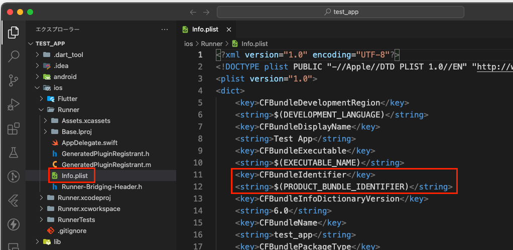
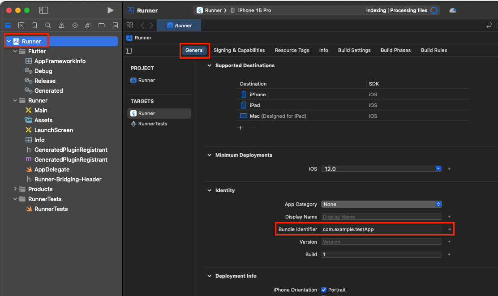
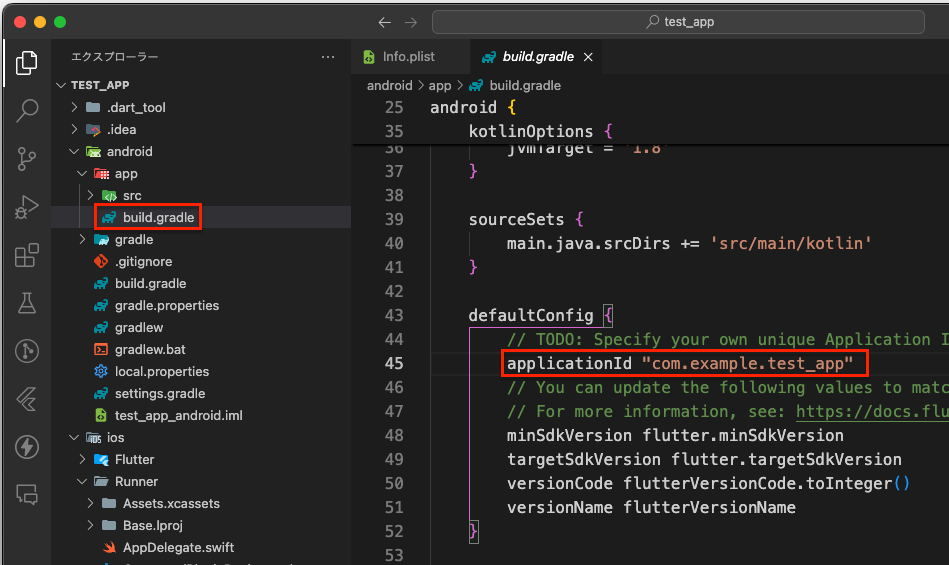

# Flutter プロジェクトでバンドルIDを確認する方法
Flutterプロジェクトにおいて、アプリのバンドルIDは、プラットフォームごとに異なるファイルに記述されています。

## iOSの場合

iOSアプリのバンドルIDは、ios/Runner/ディレクトリ内のinfo.plistファイルに記述されています。
- ios/Runner/Info.plist
  - CFBundleIdentifierキーにバンドルIDが記述されています。

  

### CFBundleIdentifier の値が $(PRODUCT_BUNDLE_IDENTIFIER) となっている場合
```
<dict>
    ...
	<key>CFBundleIdentifier</key>
	<string>$(PRODUCT_BUNDLE_IDENTIFIER)</string>
    ...
</dict>
```
Info.plist ファイルで、CFBundleIdentifier の値が $(PRODUCT_BUNDLE_IDENTIFIER) となっている場合、実際のバンドルIDは Xcode のプロジェクト設定から参照されています。
これは、Xcode のビルド設定で定義された値が使われることを意味します。

- Xcode上での設定
  - Xcodeでプロジェクトを開き、ターゲット設定（Runner）の「General」タブ内の「Identity」セクションでバンドルIDを設定できます。

  

## Androidの場合
AndroidアプリのバンドルID（アプリケーションID）は、android/appディレクトリ内のbuild.gradleファイルに記述されています。
- android/app/build.gradle
  - applicationIdというキーにバンドルIDが記述されています。

```
android {
    defaultConfig {
        applicationId "com.example.yourapp"
        ...
    }
}
```
  
