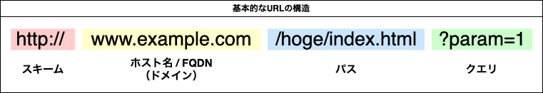

# URL  の形式について

## URL　とは
URL は、Uniform Resource **Locator** の略で、日本語に訳すと「統一資源**位置指定子**（とういつしげんいちしていし）」です。
簡単に説明すると、インターネットの資源（ファイルなど）の**場所を表す**俗称として使用されます。

## URI と URL　の違い
URI は、Uniform Resource **Identifiers** の略で、 日本語に訳すと「統一資源**識別子**（とういつしげんしきべつし）」です。
URL がインターネット上の資源の場所を表すのに対して、URI はインターネットの資源に限らず、あらゆる資源を識別できるように考えられた識別子です。

```
URI = あらゆる資源を識別するための文字列
　┗ URL = インターネット上の資源の場所
```

つまり、URI は広い概念であり、URL はその中に包含される関係にあります。
現在有効な RFC 文書などでは、URL という名称は使われず、URI が使用されます。

## URI の 書式
基本的な html スキームの場合、次のような書式で表現されます。



### スキーム
ブラウザーがリソースを取得する際に使用するプロトコルを示します。
その他にも、アプリケーションプロトコルを指定することも可能です。

例：http, https, file, ftp, mailto , ...

モバイルアプリの場合、カスタムURLスキームをアプリ側で設定しておくことで、Webページからリンクをタップするとアプリの特定のコンテンツを表示するといった機能にも使用されます。（ディープリンク）

### ホスト名 / FQDN
リソースが配置されているサーバーのドメイン名やIPアドレスを表します。
ホスト名と呼ぶことがありますが、正式にはFQDNが適当。

▼ホスト名の例
| サイト名     | URL                              |
|--------------|----------------------------------|
| Yahoo! Japan | [www.yahoo.co.jp](https://www.yahoo.co.jp) |
| gmail        | [mail.google.com](https://mail.google.com) |
| 楽天証券     | [member.rakuten-sec.co.jp](https://member.rakuten-sec.co.jp) |
| 東京大学     | [www.u-tokyo.ac.jp](https://www.u-tokyo.ac.jp) |

ホスト名は右から読むと階層的な名付けになっています。
Yahoo! Japanを例に挙げると、

#### jp
最上位ドメイン (TLD: Top-Level Domain) を表し、国や地域に関連付けられています。この場合、jp は日本を意味します。

#### co
第2レベルドメインで、企業や商業的な組織を示すものです。

#### yahoo
ドメイン名の主体であり、企業やサービスの名称を示します。

#### www
ホスト名（サブドメイン）で、wwwの場合は通常ウェブサービスを表します。

このように、ドメイン名は階層的に構成され、各部分が特定の役割を持っています。また、この階層構造によって、ドメイン名はユニークであり、世界中のリソースを一意に特定することができます。

#### サブドメイン

ホスト名の最初の部分（例: www）はサブドメインと呼ばれ、同じドメイン名内で異なるサービスや機能を区別するために使われます。
例えば、同じ yahoo.co.jp ドメインの中で、以下のように異なるサブドメインが使われることがあります。

- www.yahoo.co.jp: ウェブサイトのメインページ
- news.yahoo.co.jp: ニュースサービス
- mail.yahoo.co.jp: メールサービス

サブドメインは自由に設定できるため、ウェブサービスやシステムを柔軟に管理・拡張することが可能です。

### パス

### クエリ

## 参考文献
- [ネットワークはなぜつながるのか 第2版 知っておきたいTCP/IP、LAN、光ファイバの基礎知識](https://www.amazon.co.jp/%E3%83%8D%E3%83%83%E3%83%88%E3%83%AF%E3%83%BC%E3%82%AF%E3%81%AF%E3%81%AA%E3%81%9C%E3%81%A4%E3%81%AA%E3%81%8C%E3%82%8B%E3%81%AE%E3%81%8B-%E7%AC%AC2%E7%89%88-%E7%9F%A5%E3%81%A3%E3%81%A6%E3%81%8A%E3%81%8D%E3%81%9F%E3%81%84TCP-IP%E3%80%81LAN%E3%80%81%E5%85%89%E3%83%95%E3%82%A1%E3%82%A4%E3%83%90%E3%81%AE%E5%9F%BA%E7%A4%8E%E7%9F%A5%E8%AD%98-%E6%88%B8%E6%A0%B9/dp/4822283119/ref=sr_1_1?adgrpid=134175418048&dib=eyJ2IjoiMSJ9.vpvIHoRCn3P1bAtbklE7cemtsSOFkrZx9fPQhqk8qU97fLvmQ_V3KSnJ_E9_1u-yLRH67Hlc9nBUGTWdQUBBw3wMPFRgCOr_GYbWdscuDMwmhgMabEYdcYBFE3US1xQtgOlcrxoX-fFd-0HBYlkzwu6_R5H1pkMMWGxmD9swHfBz_vi90_P8cGuRN_mtq7nYqH8xYtNwIPwzmINHT6evH8ktla5ZdguQAqtowb068NY._3oThyd71VCQ3urAq3dEQIssm14gOUdEDEMt4ulwJOY&dib_tag=se&hvadid=698971708741&hvdev=c&hvqmt=e&hvtargid=kwd-332754015790&hydadcr=4077_13405368&jp-ad-ap=0&keywords=%E3%83%8D%E3%83%83%E3%83%88%E3%83%AF%E3%83%BC%E3%82%AF%E3%81%AF%E3%81%AA%E3%81%9C%E3%81%A4%E3%81%AA%E3%81%8C%E3%82%8B%E3%81%AE%E3%81%8B&qid=1725772701&s=books&sr=1-1)
- [マスタリングTCP/IP―入門編―(第6版) ](https://www.amazon.co.jp/%E3%83%9E%E3%82%B9%E3%82%BF%E3%83%AA%E3%83%B3%E3%82%B0TCP-IP%E2%80%95%E5%85%A5%E9%96%80%E7%B7%A8%E2%80%95-%E7%AC%AC6%E7%89%88-%E4%BA%95%E4%B8%8A-%E7%9B%B4%E4%B9%9F/dp/4274224473/ref=sr_1_6?adgrpid=134175418048&dib=eyJ2IjoiMSJ9.vpvIHoRCn3P1bAtbklE7cemtsSOFkrZx9fPQhqk8qU97fLvmQ_V3KSnJ_E9_1u-yLRH67Hlc9nBUGTWdQUBBw3wMPFRgCOr_GYbWdscuDMwmhgMabEYdcYBFE3US1xQtgOlcrxoX-fFd-0HBYlkzwu6_R5H1pkMMWGxmD9swHfBz_vi90_P8cGuRN_mtq7nYqH8xYtNwIPwzmINHT6evH8ktla5ZdguQAqtowb068NY._3oThyd71VCQ3urAq3dEQIssm14gOUdEDEMt4ulwJOY&dib_tag=se&hvadid=698971708741&hvdev=c&hvqmt=e&hvtargid=kwd-332754015790&hydadcr=4077_13405368&jp-ad-ap=0&keywords=%E3%83%8D%E3%83%83%E3%83%88%E3%83%AF%E3%83%BC%E3%82%AF%E3%81%AF%E3%81%AA%E3%81%9C%E3%81%A4%E3%81%AA%E3%81%8C%E3%82%8B%E3%81%AE%E3%81%8B&qid=1725772701&s=books&sr=1-6)


